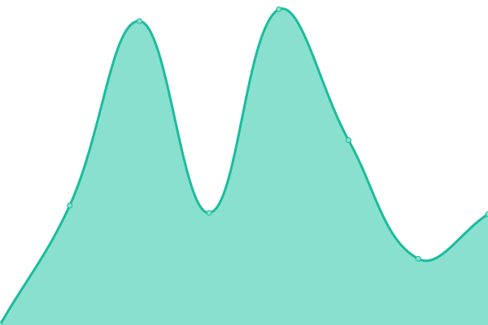

# [📈 Live Status](https://fez7yoe.github.io/upptime): <!--live status--> **所有系統都可以正常執行**

This repository contains the open-source uptime monitor and status page for [fez7yoe](fez7yoe.github.io), powered by [Upptime](https://github.com/upptime/upptime).

With [Upptime](https://upptime.js.org), you can get your own unlimited and free uptime monitor and status page, powered entirely by a GitHub repository. We use [Issues](https://github.com/fez7yoe/upptime/issues) as incident reports, [Actions](https://github.com/fez7yoe/upptime/actions) as uptime monitors, and [Pages](https://fez7yoe.github.io/upptime) for the status page.

<!--start: status pages-->
<!-- This summary is generated by Upptime (https://github.com/upptime/upptime) -->
<!-- Do not edit this manually, your changes will be overwritten -->
<!-- prettier-ignore -->
| 連結 | 狀態 | 歷史 | 回應時間 | 正常執行時間 |
| --- | ------ | ------- | ------------- | ------ |
|  [My Blog](https://fez7yoe.github.io) | 正常執行 | [my-blog.yml](https://github.com/fez7yoe/upptime/commits/HEAD/history/my-blog.yml) | 

 425毫秒
     
 | 

<a href="https://fez7yoe.github.io/upptime/history/my-blog">100.00%</a>
    

<!--end: status pages-->

[**Visit our status website →**](https://fez7yoe.github.io/upptime)

## 📄 License

- Powered by: [Upptime](https://github.com/upptime/upptime)
- Code: [MIT](./LICENSE) © [fez7yoe](fez7yoe.github.io)
- Data in the `./history` directory: [Open Database License](https://opendatacommons.org/licenses/odbl/1-0/)
